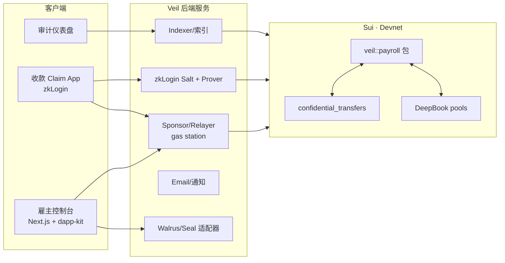
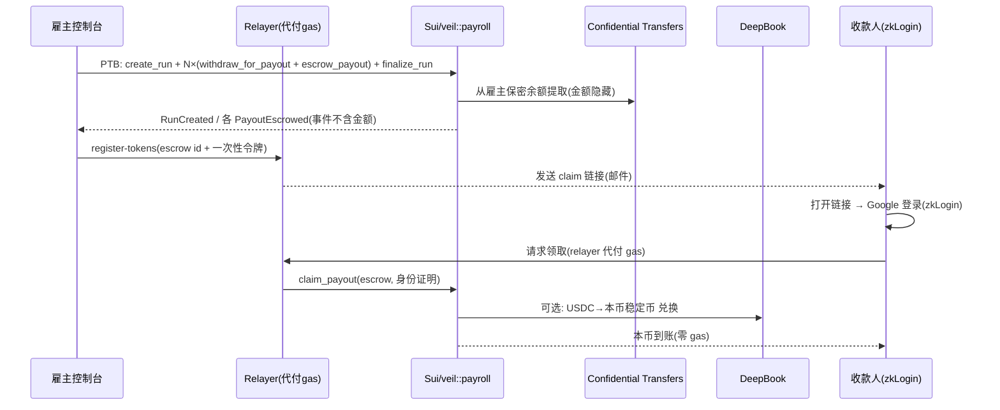

# Veil — 保密企业薪资 / 跨境支付轨道 · 完整开发文档

> **版本:** v3.0 · 完整版(Complete) | **状态:** 与实际代码库对齐、可据此实施
> **目标赛道:** Sui Overflow 2026 · DeFi & Payments(核心赛道)
> **冲刺目标:** 1st Place（$30,000）+ 可叠加奖（审计额度 / 生态资源）
> **构建网络:** Sui Devnet（Confidential Transfers 公测期；Testnet 上线后迁移）
> **一句话:** Stripe 级的全球发薪,但工资金额在链上保密,承包商几秒到账、零 gas、无需助记词。
>
> **本文与代码库的关系:** 本文档是随附代码库(`veil/`)的权威设计说明。§8 嵌入了 `veil::payroll` 合约**全文**;§7/§10–§14 描述的组件与 `apps/`、`packages/` 中的真实文件一一对应(见 §26 实现映射)。

---

## 0. 文档导航

| # | 章节 |
|---|------|
| 1 | 概述 |
| 2 | 问题与动机(三道墙) |
| 3 | 为什么是 Sui & 为什么是现在 |
| 4 | 目标用户与场景 |
| 5 | 竞品与差异化(含矩阵) |
| 6 | 产品范围(MVP / 非目标 / 路线) |
| 7 | 系统架构(组件 + 两张时序/流程图) |
| 8 | 链上设计(Move,含合约全文) |
| 9 | Confidential Transfers 集成(含 §9.1 回退设计) |
| 10 | 身份与 Gas(zkLogin + Sponsored) |
| 11 | 跨币种结算(DeepBook) |
| 12 | 链下组件(relayer / 索引 / 存储) |
| 13 | 前端(三界面) |
| 14 | API / SDK 接口面 |
| 15 | 安全与威胁建模(含 §15.1 攻击者场景、§15.2 密钥恢复) |
| 16 | 合规 |
| 17 | 测试与 QA(含 CI / 覆盖率) |
| 18 | 部署与运维 |
| 19 | 里程碑与时间线(W1–W6) |
| 20 | 商业模式与 GTM |
| 21 | 风险登记册 |
| 22 | Demo 脚本(评审 + 备份) |
| 23 | KPI 与成功指标 |
| 24 | 合规集成(TRM / Merkle / 审计) |
| 25 | 国际化与可达性(i18n / a11y) |
| 26 | 实现映射(文档 → 代码文件) |
| 附录 A | 评分对照与追溯矩阵 |
| 附录 B | 术语表 / 参考链接 |

---

## 1. 概述

**Veil** 是一条建在 Sui 上的支付轨道,让全球团队向跨境员工与承包商发薪:**金额在链上保密、收款方几秒到账、零 gas、用邮箱即可领取**,同时雇主与审计方保有完整、受限的可审计性。

核心洞察:**"链上发薪"至今不存在,不是因为链不够快或不够便宜,而是因为三道墙——隐私、入驻体验、跨币结算——同时未解。** Sui 在 2026 年恰好把这三件原语凑齐:Confidential Transfers(金额保密但可审计)、zkLogin + Sponsored Transactions(邮箱登录、零 gas)、DeepBook(链上即时汇兑)。Veil 把它们组合成一个能上线的真实产品。

**MVP 目标:** 在 Devnet 上,用**一笔原子交易(PTB)** 向若干不同国家/币种的收款人完成保密发放;收款人**手机邮箱登录、零 gas、本币到账**;审计方**用受限密钥解密整笔 run 并导出对账报告**。整条链路 **金额从不出现在任何链上事件中**。

---

## 2. 问题与动机

**墙一 · 隐私(致命)。** 没有任何公司愿意把发薪跑在公开账本上——那等于把每个人的工资、涨薪幅度、人头数、现金跑道实时暴露给竞争对手、员工彼此与所有人。这一条单独就否决了几乎所有"链上发薪"尝试。把金额公开写在链上的加密发薪/流支付工具,正因此无法进入正经企业。

**墙二 · 入驻体验。** 真实承包商分布在几十个国家,绝大多数不是 crypto 原住民。"装钱包 → 抄助记词 → 自己买原生代币付 gas"对他们等于当场放弃。

**墙三 · 跨币结算。** 公司持有 USDC 国库,但巴西、尼日利亚、菲律宾的承包商想要本币锚定稳定币或直接 USDC,且要即时、低成本到账。传统代理行清算慢、贵;现有加密方案要么只支持单一币、要么把汇兑外包给中心化交易所。

**结论:谁能同时拆掉这三道墙,谁就第一次让"链上发薪"对正经企业可用。**

---

## 3. 为什么是 Sui & 为什么是现在

| 墙 | Sui 原语 | 如何拆墙 |
|----|----------|---------|
| 隐私 | **Confidential Transfers** | 金额与余额链上隐藏,发收双方仍可见、且可被授权方审计(2026/06 公测,几乎无人来得及集成) |
| 入驻 | **zkLogin** | Google/邮箱登录直接派生 Sui 地址,无助记词 |
| 入驻 | **Sponsored Transactions** | relayer 代付 gas,收款方零成本、不碰原生代币 |
| 结算 | **DeepBook** | 链上订单簿做亚秒级、低成本本币兑换 |
| 原子性 | **Programmable Transaction Blocks** | 一笔交易批量发 N 人 + 汇兑,要么全成要么全不成 |
| 授权 | **对象模型 + Capability** | AdminCap / AuditorCap 细粒度授权,镜像协议的角色分离 |

**"为什么是现在"是本项目最锋利的卖点:** Confidential Transfers 在 2026 年 6 月才进入公测,是全场最新的 Sui 能力。第一个把它落到真实支付场景的项目,会给评委一个无法反驳的"只有 Sui、只有现在才做得出"的印象。换任何一条公链,墙一都拆不掉。

---

## 4. 目标用户与场景

**主攻场景:全球远程团队发薪 / 承包商支付。**

| 画像 | 关心什么 |
|------|---------|
| 薪资管理员(雇主) | 隐私、合规、对账、成本、一键批量 |
| 承包商 / 员工(收款人) | 用熟悉的方式、几秒钟、拿到我要的币 |
| 财务 / 审计 / 监管 | 在授权范围内看到真实金额做记账、报税、审计 |

**扩展场景(路线图,非 MVP):** B2B 供应商/发票支付、DAO 贡献者发薪、企业国库内部划转、跨境汇款。复用同一条保密 + 零 gas + 汇兑轨道。

---

## 5. 竞品与差异化

- **Deel / Remote / Rise(EOR & 承包商发薪):** 法币轨道,跨境 1–3% 抽成、多日到账;链下账本,无链上可编程性与链上保密。
- **Request Finance(加密发票/支付):** 金额公开写在链上,无隐私;入驻仍需钱包。
- **LlamaPay / Sablier / Superfluid(代币流支付):** 金额公开、仅服务 crypto 原住民、无邮箱/零 gas 入驻、无跨币结算、无"保密 + 可审计"。

**一句话差异化:Veil 是唯一同时做到「金额保密 + 可审计 + 邮箱零 gas 登录 + 即时跨币结算」的支付轨道。**

| 方案 | 金额链上保密 | 可审计 | 邮箱/零 gas 入驻 | 即时跨币结算 | 链上可编程 | 目标用户 |
|------|:---:|:---:|:---:|:---:|:---:|------|
| Deel / Remote / Rise | —(链下) | ✓ | ✓(法币) | 部分 | ✗ | 企业 |
| Request Finance | ✗(公开) | ✓ | ✗ | ✗ | ✓ | crypto 团队 |
| LlamaPay / Sablier / Superfluid | ✗(公开) | 部分 | ✗ | ✗ | ✓ | crypto 原住民 |
| **Veil** | **✓** | **✓** | **✓** | **✓** | **✓** | **出海/远程团队** |

> 左边每一个都至少缺一项;**只有 Veil 四项全中**——而四项全中,只有在 2026 年的 Sui 上(Confidential Transfers 公测)才第一次成为可能。

---

## 6. 产品范围

**MVP(in-scope,必须现场跑通):**
1. 雇主控制台:创建 Payroll Run、按邮箱加收款人(金额、目标币种)、一键发放。
2. 链上保密批量发放:一个 PTB 内完成 N 笔发放,**金额不出现在任何事件中**。
3. 收款端:claim 链接 → zkLogin 邮箱登录 → 零 gas → 经 DeepBook 兑成目标币到账。
4. 审计端:用 AuditorCap/审计密钥解密整笔 run、对账、导出报告。
5. 薪资单:每笔生成 Payslip(可选 Walrus+Seal 加密存储)。

**非目标(明确不做):** EOR 法律主体、报税申报、福利、复杂审批流、法币出入金、移动原生 App。

**路线图:** B2B/发票支付 → 国库划转 → 多稳定币 & 多链入金 → 移动 App → 合规牌照路径。

---

## 7. 系统架构



**职责划分:** 链上(`veil::payroll` + Confidential Transfers + DeepBook)负责资金与状态;Relayer 负责 gas 代付与领取执行;zkLogin 服务负责收款人身份;Indexer 负责对账数据;Walrus/Seal 负责加密薪资单。

**发薪一笔的时序:**



---

## 8. 链上设计(Move)

包名 `veil::payroll`。核心原则:**事件绝不泄露金额;所有授权走 Capability;没有任何"应用方超级密钥"能解密所有人。**

**对象与能力一览:**

| 对象 | 作用 | 关键字段 |
|------|------|---------|
| `Employer` | 雇主档案 | owner、auditor_pubkey、runs_created |
| `AdminCap` | 发薪/管理授权 | employer(绑定雇主) |
| `AuditorCap` | 审计授权 | employer |
| `PayrollRun` | 一次发薪批次 | status、recipient_count、manifest_blob |
| `PayoutEscrow<T>` | 单笔可领取托管(共享对象) | recipient_id_hash、funds、status |
| `Payslip` | 加密薪资单引用 | payslip_blob(Walrus blob id) |

**状态机:** `PayrollRun.status`:`EXECUTING(1) → FINALIZED(2)`。`PayoutEscrow.status`:`pending(0) → claimed(1)`(领取后对象被销毁)。

**领取的身份绑定:** `escrow.recipient_id_hash = keccak256(一次性令牌)`;领取时链上校验 `keccak256(proof_of_id) == recipient_id_hash`,令牌一次性、防盗领。

> **构建模式说明:** 下方合约用标准 `Coin<T>` 以保证**今天就能编译运行**;保密由 `veil::confidential_adapter::withdraw_for_payout` 收敛,W1 接入官方 beta 时**仅替换该函数体、签名不变**。无论哪种模式,**事件层永不携带金额**这一隐私不变式都成立。

### 8.1 `veil::payroll` 合约全文

```move
/// Veil — confidential payroll & cross-border payout rail (Sui).
module veil::payroll {
    // Move 2024 implicitly imports object::{Self, ID, UID}, transfer,
    // tx_context::{Self, TxContext}, option::{Self, Option}, vector — re-importing
    // them errors with "duplicate alias", so we declare only the non-implicit
    // modules below. (Older toolchains without the implicit prelude: add
    // `use sui::object::{Self, ID, UID};`, `use sui::tx_context::{Self, TxContext};`,
    // `use sui::transfer;` back here.)
    use sui::coin::{Self, Coin};
    use sui::balance::Balance;
    use sui::clock::{Self, Clock};
    use sui::event;
    use sui::hash;

    // ===== Errors =====
    const ENotAuthorized: u64 = 0;
    const ERunFinalized: u64  = 1;
    const EAlreadyClaimed: u64 = 2;
    const EBadProof: u64      = 3;

    // ===== Run status =====
    const STATUS_EXECUTING: u8 = 1;
    const STATUS_FINALIZED: u8 = 2;

    // ===== Capabilities =====
    public struct AdminCap   has key, store { id: UID, employer: ID }
    public struct AuditorCap has key, store { id: UID, employer: ID }

    // ===== Core objects =====
    public struct Employer has key {
        id: UID,
        owner: address,
        name: vector<u8>,
        auditor_pubkey: vector<u8>,
        runs_created: u64,
    }

    /// `store` is required so the PTB can `transferObjects([run], employer)` after
    /// finalize (TransferObjects uses public_transfer, which needs key + store).
    public struct PayrollRun has key, store {
        id: UID,
        employer: ID,
        status: u8,
        recipient_count: u64,
        manifest_blob: Option<vector<u8>>, // Walrus blob id of encrypted run manifest
        created_at_ms: u64,
    }

    /// Claimable payout, SHARED until the recipient onboards (zkLogin) and claims.
    /// In confidential mode, `funds: Balance<T>` becomes a confidential balance handle.
    public struct PayoutEscrow<T> has key, store {
        id: UID,
        run: ID,
        recipient_id_hash: vector<u8>,
        funds: Balance<T>,
        status: u8, // 0 pending, 1 claimed
    }

    public struct Payslip has key, store {
        id: UID,
        run: ID,
        recipient: address,
        payslip_blob: vector<u8>, // Walrus blob id, Seal-encrypted
    }

    // ===== Events (NEVER carry amounts) =====
    public struct RunCreated     has copy, drop { run: ID, employer: ID }
    public struct PayoutEscrowed has copy, drop { run: ID, escrow: ID, recipient_id_hash: vector<u8> }
    public struct PayoutClaimed  has copy, drop { run: ID, escrow: ID, recipient: address }
    public struct RunFinalized   has copy, drop { run: ID, recipient_count: u64 }

    // ===== Employer onboarding =====
    public fun create_employer(
        name: vector<u8>,
        auditor_pubkey: vector<u8>,
        ctx: &mut TxContext,
    ): (Employer, AdminCap, AuditorCap) {
        let emp = Employer {
            id: object::new(ctx),
            owner: tx_context::sender(ctx),
            name,
            auditor_pubkey,
            runs_created: 0,
        };
        let eid = object::id(&emp);
        let admin   = AdminCap   { id: object::new(ctx), employer: eid };
        let auditor = AuditorCap { id: object::new(ctx), employer: eid };
        (emp, admin, auditor)
    }

    public entry fun register(name: vector<u8>, auditor_pubkey: vector<u8>, ctx: &mut TxContext) {
        let (emp, admin, auditor) = create_employer(name, auditor_pubkey, ctx);
        let who = tx_context::sender(ctx);
        transfer::transfer(emp, who);
        transfer::public_transfer(admin, who);
        transfer::public_transfer(auditor, who);
    }

    // ===== Payroll run lifecycle =====
    public fun create_run(
        emp: &mut Employer,
        cap: &AdminCap,
        manifest_blob: vector<u8>, // empty vector = none
        clock: &Clock,
        ctx: &mut TxContext,
    ): PayrollRun {
        assert!(cap.employer == object::id(emp), ENotAuthorized);
        emp.runs_created = emp.runs_created + 1;
        let manifest = if (std::vector::length(&manifest_blob) == 0) {
            std::option::none<vector<u8>>()
        } else {
            std::option::some(manifest_blob)
        };
        let run = PayrollRun {
            id: object::new(ctx),
            employer: object::id(emp),
            status: STATUS_EXECUTING,
            recipient_count: 0,
            manifest_blob: manifest,
            created_at_ms: clock::timestamp_ms(clock),
        };
        event::emit(RunCreated { run: object::id(&run), employer: object::id(emp) });
        run
    }

    /// Escrow one payout (called once per recipient inside a PTB). Escrow is shared
    /// so a DIFFERENT address (the recipient, after zkLogin) can claim it.
    public fun escrow_payout<T>(
        run: &mut PayrollRun,
        cap: &AdminCap,
        recipient_id_hash: vector<u8>,
        payment: Coin<T>,
        ctx: &mut TxContext,
    ) {
        assert!(cap.employer == run.employer, ENotAuthorized);
        assert!(run.status == STATUS_EXECUTING, ERunFinalized);
        run.recipient_count = run.recipient_count + 1;
        let escrow = PayoutEscrow<T> {
            id: object::new(ctx),
            run: object::id(run),
            recipient_id_hash,
            funds: coin::into_balance(payment),
            status: 0,
        };
        event::emit(PayoutEscrowed {
            run: object::id(run),
            escrow: object::id(&escrow),
            recipient_id_hash,
        });
        transfer::public_share_object(escrow);
    }

    public fun finalize_run(run: &mut PayrollRun, cap: &AdminCap) {
        assert!(cap.employer == run.employer, ENotAuthorized);
        run.status = STATUS_FINALIZED;
        event::emit(RunFinalized { run: object::id(run), recipient_count: run.recipient_count });
    }

    // ===== Recipient claim (relayer sponsors gas) =====
    public fun claim_payout<T>(
        escrow: PayoutEscrow<T>,
        proof_of_id: vector<u8>,
        ctx: &mut TxContext,
    ): Coin<T> {
        let escrow_id = object::id(&escrow);
        let PayoutEscrow { id, run, recipient_id_hash, funds, status } = escrow;
        assert!(status == 0, EAlreadyClaimed);
        assert!(hash::keccak256(&proof_of_id) == recipient_id_hash, EBadProof);
        object::delete(id);
        event::emit(PayoutClaimed { run, escrow: escrow_id, recipient: tx_context::sender(ctx) });
        coin::from_balance(funds, ctx)
    }

    public entry fun claim_to_sender<T>(
        escrow: PayoutEscrow<T>,
        proof_of_id: vector<u8>,
        ctx: &mut TxContext,
    ) {
        let c = claim_payout<T>(escrow, proof_of_id, ctx);
        transfer::public_transfer(c, tx_context::sender(ctx));
    }

    // ===== Payslip (encrypted blob ref on Walrus) =====
    public entry fun issue_payslip(
        run: &PayrollRun,
        cap: &AdminCap,
        recipient: address,
        payslip_blob: vector<u8>,
        ctx: &mut TxContext,
    ) {
        assert!(cap.employer == run.employer, ENotAuthorized);
        let slip = Payslip {
            id: object::new(ctx),
            run: object::id(run),
            recipient,
            payslip_blob,
        };
        transfer::public_transfer(slip, recipient);
    }

    // ===== Read helpers =====
    public fun run_status(run: &PayrollRun): u8 { run.status }
    public fun recipient_count(run: &PayrollRun): u64 { run.recipient_count }
    public fun auditor_pubkey(emp: &Employer): vector<u8> { emp.auditor_pubkey }
}
```

### 8.2 `veil::confidential_adapter`(W1 集成边界)

```move
/// FALLBACK MODE (current): split a standard coin.
/// CONFIDENTIAL MODE (W1): replace ONLY this body with a confidential-balance
/// withdrawal from the official beta — same signature, payroll.move unchanged.
module veil::confidential_adapter {
    // TxContext is implicitly imported in Move 2024.
    use sui::coin::{Self, Coin};

    public fun withdraw_for_payout<T>(
        source: &mut Coin<T>,
        amount: u64,
        ctx: &mut TxContext,
    ): Coin<T> {
        coin::split(source, amount, ctx)
    }
}
```

### 8.3 批量发放 PTB(SDK 构造,见 `packages/sdk/src/ptb.ts`)

```ts
const tx = new Transaction();
const clock = tx.object('0x6');
const run = tx.moveCall({ target: `${PKG}::payroll::create_run`,
  arguments: [tx.object(employerObjectId), tx.object(adminCapId),
              tx.pure.vector('u8', manifestBytes), clock] });

const source = tx.object(fundingCoinId);
for (const r of recipients) {
  const piece = tx.moveCall({ target: `${PKG}::confidential_adapter::withdraw_for_payout`,
    typeArguments: [stableCoinType], arguments: [source, tx.pure.u64(r.amount)] });
  tx.moveCall({ target: `${PKG}::payroll::escrow_payout`,
    typeArguments: [stableCoinType],
    arguments: [run, tx.object(adminCapId), tx.pure.vector('u8', r.idHash), piece] });
}
tx.moveCall({ target: `${PKG}::payroll::finalize_run`, arguments: [run, tx.object(adminCapId)] });
tx.transferObjects([run], tx.pure.address(employerAddress));
// Sponsored:relayer 作为 gas owner;雇主签名交易数据。
```

---

## 9. Confidential Transfers 集成

**模型(继承自协议):** 发行方对代币启用"保密模式";金额与余额链上隐藏;发收双方可见;敏感数据仅通过受限、授权、可审计的流程访问;应用方默认无特权访问。

**Veil 的用法:**
- **发行方角色(demo 内自持):** 自发一个测试稳定币并开启保密模式——既能演示保密发放,又能演示"审计方解密"。
- **三类密钥:** 雇主(解密自己发出的金额)、收款人(解密自己收到的)、审计方(受限范围解密整笔 run)。
- **链上隐藏:** 发薪金额以承诺形式写入,公链不可见;`veil::payroll` 事件一律不含金额。
- **审计解密:** 审计方用 AuditorCap + 审计密钥离线解密 run 清单并对账;链上不暴露明文。

**最大技术不确定性:保密余额能否由 Escrow 对象托管 —— W1 必须先用官方 repo 验证。**

### 9.1 回退设计(de-risk 最大不确定性)

W1 第一天即对官方 repo 做"探针测试",据结果三选一,**任一路径都不影响 demo 弧线**:

- **Plan A(首选 · 对象托管保密余额):** 若公测支持保密余额由共享对象持有,则用 §8 的 `PayoutEscrow` 托管,收款人 zkLogin 后从 escrow 领取。最干净,支持"未入驻先收款"。
- **Plan B(收款人先入驻):** 若保密余额只能存在于账户余额,则 claim 链接先引导 zkLogin 派生地址,**再**由雇主 PTB 直接向该地址保密发放——把"入驻"前置一步。多一步、完全可行。
- **Plan C(relayer 托管中转 + 即时转出):** 由 relayer 的保密余额做一跳中转,收款时原子转出。仅在 A/B 均受限时使用,并在文档/demo 中**坦诚标注**为过渡实现。

> 评审偏好诚实 + 架构正确,胜过假装完成。三条路径都已想清,意味着这条最大技术雷在 W1 即被拆除,而非赌运气。

---

## 10. 身份与 Gas(zkLogin + Sponsored Transactions)

**zkLogin 入驻流程:**
1. 收款人点 claim 链接 → 选 Google 登录(OAuth)。
2. 前端生成临时密钥对 + nonce;OAuth 返回后经 Prover 生成 ZK 证明。
3. 证明 + 用户 salt 派生出该用户的 Sui 地址——全程无助记词、无装钱包。

**Sponsored Transactions(零 gas):** Veil relayer 充当 gas station,对收款人的 `claim_payout`(及可选 DeepBook 兑换)作为 sponsor 支付 gas;收款人余额可为零、永不需持有原生代币。

**Claim-link 机制:** 链接内含 `run_id + 一次性令牌`;领取时链上校验 `keccak256(proof) == recipient_id_hash`,防盗领。

> **当前实现 vs 生产路径:** 随附代码中,relayer 直接以自身密钥执行领取并把资金转给收款地址(演示简化,见 `apps/relayer/src/routes/claims.ts`)。**生产路径(W3)**:收款人用 zkLogin 签名、relayer 仅 sponsor gas。

---

## 11. 跨币种结算(DeepBook)

- 收款人选择目标币种(本币锚定稳定币或 USDC)。
- 领取时在同一 PTB 内通过 DeepBook 现货池完成 `USDC → 目标币` 兑换,亚秒级、低成本。
- **滑点保护:** 设最小成交额(`min_out`),超滑点回退。
- **流动性不足的本币稳定币对的回退:** 若该对无可用池,**直接以 USDC 到账**(`maybeSwap` 原样返回源币,见 `packages/sdk/src/deepbook.ts`),并在 UI 提示;后续再做多跳路由或换池。

---

## 12. 链下组件

| 组件 | 文件 | 职责 |
|------|------|------|
| Relayer / Gas Station | `apps/relayer/src/index.ts` + `routes/*` | 组装并 sponsor 交易、执行领取、提供审计数据;不托管用户资金 |
| zkLogin 服务(W3) | (env: PROVER/SALT URL) | salt 管理 + Prover 调用 |
| Indexer | (监听事件) | 监听 `veil::payroll` 事件构建对账视图,**不落库金额明文** |
| Walrus / Seal 适配器(W5) | (env: WALRUS URL) | 加密薪资单/发票作为 blob 存 Walrus,Seal 按条件解锁 |
| 通知服务 | relayer 内 console / 邮件 | 给收款人发 claim 链接 |

---

## 13. 前端

| 界面 | 文件 | 功能 |
|------|------|------|
| 雇主控制台 | `apps/web/app/employer/page.tsx` | 连钱包、注册雇主、加收款人、执行 PTB、回读 escrow 事件、向 relayer 注册令牌、展示 claim 链接 |
| 收款 Claim App | `apps/web/app/claim/[token]/page.tsx` | 读取领取信息、zkLogin(W3)/连钱包取地址、领取、显示到账 |
| 审计仪表盘 | `apps/web/app/audit/page.tsx` | 按 runId 拉取对账、表格展示、CSV 导出 |

技术栈:Next.js(App Router)+ `@mysten/dapp-kit` + `@mysten/sui` + `@tanstack/react-query` + `@veil/sdk`。UI 当前为简洁功能版,精修排进 W5。

---

## 14. API / SDK

**Relayer HTTP API:**
- `GET /health` — 健康检查(返回已配置的 packageId)。
- `POST /runs/register-tokens` — 链上 run 执行后注册各收款人一次性令牌,返回 claim 链接。
- `GET /claims/:token` — 领取信息(收款人、展示金额、状态)。
- `POST /claims/:token/claim` — 执行领取(body: `recipientAddress`),relayer 代付 gas。
- `GET /audit/runs/:runId` — 审计对账数据。

**SDK(`@veil/sdk`)接口面:**
- `buildExecuteRunTx(params)` — 构造批量发放 PTB。
- `buildClaimToSenderTx(params)` — 构造领取交易。
- `idHash(secret)` / `randomSecret()` — 身份哈希与一次性令牌(keccak256,与 Move 一致)。
- `encodeManifest/decodeManifest` — run 清单编解码(W1/W5 替换为真实加密)。
- `maybeSwap(tx, cfg, coin, target)` — 可选 DeepBook 兑换(W4)。
- `VeilClient` — 封装 SuiClient 与上述构造器,并提供 `getPayslips(owner)`。

---

## 15. 安全与威胁建模

**授权基线:** 所有敏感操作走 Capability(`AdminCap`/`AuditorCap`,均绑定 `employer` id);无任何应用级超级密钥可解密全体;**事件不含金额**。

**主要威胁概览:**

| 威胁 | 缓解 |
|------|------|
| 盗领 escrow | 链上校验 `keccak256(proof) == recipient_id_hash`;一次性令牌 |
| 越权操作 | Capability 校验 `cap.employer == run/employer.id` |
| 金额泄露 | 事件/索引均不含金额;仅受限密钥可解密 |
| 重放交易 | nonce + 一次性令牌 + 对象消耗语义(escrow 领取后销毁) |

### 15.1 攻击者场景与缓解

| 攻击者 | 场景 | 缓解 |
|------|------|------|
| 恶意/被攻破的 relayer | 篡改交易、扣押 gas、抢跑 FX、拒服务 | relayer **不托管用户资金、仅代付 gas**;交易数据由雇主/收款人签名,relayer 改不了语义;FX 设 `min_out`;多 relayer 冗余 |
| Admin 密钥被盗 | 冒充雇主发起伪 run | AdminCap 为对象、可撤销/轮换;大额 run 走 multisig;异常发放速率告警 |
| 重放 / 双花领取 | 重复使用 claim 令牌 | 一次性令牌 + nonce + 对象消耗(escrow 领取后即销毁) |
| FX 抢跑 | 在兑换前后夹击 | 同一 PTB 原子完成 + `min_out` 滑点上限 |
| 解密密钥泄露 | 审计/雇主密钥外泄致金额暴露 | 见 §15.2;密钥分层、范围最小化、可轮换 |
| 钓鱼 claim 链接 | 诱导收款人在假站点登录 | 域名校验 + 链上 `proof ↔ id_hash` 校验,假站点拿不到资金 |

### 15.2 密钥泄露与恢复

- **分层与最小范围:** 雇主密钥只能解密自己发出的金额;收款人只能解密自己收到的;审计密钥受 AuditorCap 约束、每次访问留痕。**不存在能解密全体的应用级超级密钥**(镜像协议设计)。
- **轮换:** AdminCap/AuditorCap 为可转移对象,支持作废旧 cap、铸发新 cap;审计公钥可在 `Employer` 上更新。
- **泄露应对:** 立即轮换受影响 cap、暂停该雇主新 run、对历史 run 做受控审计复核;因金额本就以承诺形式存储,单一密钥泄露不等于全量泄露。

---

## 16. 合规

- **角色分离(继承协议):** 发行方定义访问策略;分析方支持监控/调查;应用方无特权访问;敏感数据访问需特定目的 + 授权 + 全程可审计。
- **审计方解密:** 仅在授权范围内、留痕。
- **设计取向:** 不做完整 KYC/AML,但预留审计与监控接入点,使其能纳入既有合规工作流(详见 §24)。

---

## 17. 测试与 QA

- **Move 单元测试(`move/veil/tests/payroll_tests.move`):** `happy_path_escrow_and_claim`(发放→领取,断言金额到账)、`claim_with_wrong_proof_aborts`(错误令牌触发 `EBadProof`)。覆盖授权、状态机、错误码、领取校验。
- **集成测试:** Devnet 上端到端跑通"发放→领取→兑换→审计解密"。
- **手动 QA:** 多币种、多收款人、异常路径(超滑点、重复领取)。

**CI(GitHub Actions,`.github/workflows/ci.yml`):** 每次 PR 跑 `sui move build` + `sui move test` + 前端 `typecheck`;main 分支保护、要求绿灯合并。

**覆盖率目标:**
- Move 合约:行覆盖 ≥ 85%,**授权与状态机分支 100%**(每个 `assert!`/错误码都有失败用例)。
- 关键用户路径:发放→领取→兑换→审计解密,各一条自动化 e2e。
- 安全回归:为 §15.1 每个攻击者场景写一条"应被拒绝"的负向测试。

---

## 18. 部署与运维

- **环境:** Devnet(随 Confidential Transfers 公测);Testnet 上线后迁移。
- **包发布:** `./scripts/publish.sh`(`sui client publish`);记录 package ID 与 upgrade cap。
- **运维:** Relayer/Indexer 容器化;监控 gas 余额与事件滞后。
- **Devnet 重置预案:** 部署脚本一键重建 + 预置 4 个收款人样例;**录制备份 demo 视频**防现场抽风。
- **详细部署 / GitHub 步骤见随附《02-deployment-and-github-guide.md》。**

---

## 19. 里程碑与时间线

> 按约 5–6 周倒排;**真实提交截止日须在 participant handbook / 官方 Telegram 确认**。

| 周 | 交付 | 退出标准 |
|----|------|---------|
| W1 | 跑通官方 repo + 原型钱包;发保密稳定币;打通**单笔**保密转账(拆核心雷,见 §9.1) | 浏览器上确认单笔金额为密文 |
| W2 | PTB 批量发放 + Capability + 审计方解密对账 | N 人一笔成功 + 审计可对账 |
| W3 | zkLogin 入驻 + Sponsored relayer + claim 流程 | 收款人零钱包/零 gas 到账 |
| W4 | DeepBook 到账汇兑 | 本币到账 + 滑点保护 |
| W5 | Walrus+Seal 薪资单;打磨 UI;敲定 design partner;补测试;申请审计额度 | 加密薪资单可领 + 1 个真实试点 |
| W6 | 排练脚本、录备份视频、部署、写提交文案 | 现场 3 分钟可复现 + 备份视频 |

---

## 20. 商业模式与 GTM

- **收入:** 支付额的薄利差(目标 0.5–1%,显著低于 Deel 的 3%+)+ 雇主控制台席位订阅 + 汇兑价差分成。
- **市场:** 全球薪资软件 + 跨境 B2B 支付 + 承包商/零工发薪——均为大盘;即便很薄的费率,跨境承包商发薪也是一门有意义的生意(具体规模待量化验证)。
- **GTM 楔子:** 先攻"用加密发薪的远程团队 / DAO / 出海代理机构",再扩到传统出海企业。
- **赛后:** 申请 Sui 生态 grant / Moonshot;以真实 design partner 的发薪量做种子轮叙事。

---

## 21. 风险登记册

| 风险 | 等级 | 缓解 |
|------|------|------|
| Confidential Transfers 仍是 Devnet 公测 | 高 | W1 验证;备份 demo;Testnet 上线后迁移 |
| 保密余额能否被 Escrow 托管 | 高 | W1 用官方 repo 验证;否则走 §9.1 回退 |
| beta API churn | 中 | 锁版本;封装适配层 |
| 异国稳定币对流动性不足 | 中 | 回退到 USDC 到账 |
| 真实牵引力不足 | 中 | 尽早锁定 1 个 design partner |
| 货币转移牌照(MTL 等) | 中 | 明确为赛后路线;MVP 不做法币出入金 |

---

## 22. Demo 脚本(评审 + 备份)

**3 分钟现场弧线:**
- 0:00–0:30 问题:链上发薪为何不存在(隐私+入驻+结算三墙),Veil 全解。
- 0:30–1:30 雇主端:建 run、加 4 个不同币种收款人、一键发;浏览器里地址可见、**金额是密文**。
- 1:30–2:15 收款端:手机 Google 登录(无钱包无助记词)、经 DeepBook 兑本币、**零 gas** 到账。
- 2:15–2:50 审计端:切审计密钥、**解密整笔 run**、对账、导出报告。
- 2:50–3:00 牵引力 + 愿景:design partner 已在真跑;发薪今天、B2B/国库明天。

**备份:** 录制全流程视频;Devnet 抽风时切视频,口播同弧线。

---

## 23. KPI 与成功指标

**Demo 级(评审当场可验证):**
- 一笔 PTB 完成 ≥ 4 名收款人发放,浏览器中**金额为密文**(beta 接入后)。
- 收款端从"点链接"到"本币到账" ≤ 60 秒,**收款人 gas 花费 = 0**。
- 审计端解密整笔 run 并导出对账,**链上零金额泄露**。

**赛后级(证明"能存活"):**
- 签约 design partner 数;真实发放笔数 / 金额。
- 收款人入驻完成率、平均入驻时长(目标 < 2 分钟)。
- 单笔综合成本 vs Deel(目标 < 1/3);兑换平均滑点。
- 90 天留存(雇主月度复用 run)。

---

## 24. 合规集成(TRM / Merkle / 审计)

- **角色分离落地:** 发行方(策略)/ 分析方(监控)/ 应用方(无特权)三权分立,Veil 作为应用方**不持有全量解密能力**。
- **风控接入点:** 为 TRM Labs / Merkle Science 类服务预留风险信号接口——在不暴露明文金额的前提下,支持监控与调查工作流。
- **审计工作流:** 审计方访问 = 特定目的 + 授权 + 全程留痕;导出报告附访问日志。
- **数据留存:** 链上不存明文;链下加密薪资单存 Walrus、Seal 控权,按企业策略设保留期。
- **边界声明:** Veil 不充当 EOR/法律主体、不做法币出入金;真实货币转移牌照(如 MTL)属赛后路线,文档明确标注以示清醒(见 §21)。

---

## 25. 国际化与可达性(i18n / a11y)

- **多语言:** 收款端默认按浏览器语言切换(英/西/葡/中等优先),覆盖主要承包商市场。
- **低带宽 / 移动优先:** Claim App 轻量化、弱网可用;支持非智能机降级路径(链接 + 短信通知)。
- **可达性:** 遵循 WCAG AA(对比度、键盘可达、屏幕阅读器标签);金额/状态文本与图标双重表达。
- **本地化金额展示:** 按地区显示币种与格式,降低非 crypto 用户认知门槛。

---

## 26. 实现映射(文档 → 代码文件)

| 设计章节 | 代码落点 |
|---------|---------|
| §8 链上设计 | `move/veil/sources/payroll.move` |
| §8.2 / §9 保密适配 | `move/veil/sources/confidential_adapter.move`、`packages/sdk/src/confidential.ts` |
| §8.3 批量 PTB | `packages/sdk/src/ptb.ts`(`buildExecuteRunTx`) |
| §10 领取 / gas | `apps/relayer/src/routes/claims.ts`、`apps/relayer/src/sui.ts` |
| §11 DeepBook FX | `packages/sdk/src/deepbook.ts`(`maybeSwap`) |
| §12 relayer / 审计 API | `apps/relayer/src/{index,store,routes/*}.ts` |
| §13 前端三界面 | `apps/web/app/{employer,claim/[token],audit}/page.tsx` |
| §14 SDK 接口 | `packages/sdk/src/{index,client,ptb,utils,types}.ts` |
| §17 测试 / CI | `move/veil/tests/payroll_tests.move`、`.github/workflows/ci.yml` |
| §18 部署 | `scripts/publish.sh`、`README.md`、`docs/02-...md` |

---

## 附录 A:评分对照与追溯矩阵

**提交清单:**
- [ ] 已部署合约 + 公开 package ID
- [ ] 开源 repo + 架构 README(已含)
- [ ] 现场可跑 demo + 备份视频
- [ ] "why Sui / why now" 一段清晰陈述(§3)
- [ ] design partner / 牵引力证据
- [ ] 安全 / 审计计划(OZ / OtterSec 额度)
- [ ] roadmap(发薪→B2B→国库)(§19/§20)

**评分追溯矩阵(评审标准 → 文档落点):**

| 评审维度 | 在哪里被满足 |
|---------|-------------|
| 真实用到 Sui 特有能力 | §3、§8、§9、§10、§11 |
| 能跑的 demo + 真用栈(非套壳) | §6、§7、§22、§17 e2e、§26 实现映射 |
| 清晰的问题 & 为什么是 Sui | §2、§3 |
| 至少两个维度强(技术/产品/UX/洞察) | 技术 §8–§11 + 产品/UX §6/§13/§25 + 市场 §5/§20 |
| 赛后可持续 | §19、§20、§23 |
| 安全 / 合规成熟度 | §15、§16、§24 |
| 牵引力 | §20 + design partner |

---

## 附录 B:术语表 / 参考链接

- **Confidential Transfers:** 金额/余额链上保密、可审计;Devnet 公测。仓库:github.com/MystenLabs/confidential-transfers
- **zkLogin:** OAuth 登录派生 Sui 地址,无助记词。
- **Sponsored Transactions:** 第三方代付 gas。
- **PTB:** 一笔交易内原子组合多次 Move 调用。
- **DeepBook:** Sui 原生链上订单簿(Spot/Margin/Predict)。
- **Walrus / Seal:** 去中心化存储 / 门限加密访问控制。
- **Capability:** Sui 对象式授权凭证(此处为 AdminCap / AuditorCap)。
